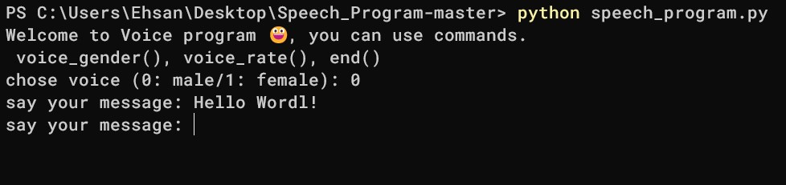

# Speech Program



## 📝 Description
A simple and interactive **Text-to-Speech (TTS)** application built with Python. This program allows users to convert text into speech while providing real-time control over voice settings through custom commands.

## ✨ Features
- **Dynamic Text-to-Speech:** Convert any typed message into clear audio.
- **Voice Customization:** Toggle between male and female voices easily.
- **Adjustable Speech Rate:** Control how fast or slow the program speaks.
- **Command-Based Interface:** Interactive terminal experience with custom functions.

## 🛠️ Technologies Used
- **Python:** Core programming language.
- **pyttsx3:** Offline text-to-speech conversion library.

## 🚀 How to Run

### 1. Install Dependencies
Make sure you have Python installed, then install the required library:
```bash
pip install pyttsx3
```
Note: If you have a requirements.txt file, use:
```bash
pip install -r requirements.txt
```
### 2. Start the Program
Run the script and follow the instructions in the terminal:
```bash
python speech_program.py
```
## 🎮 Commands
While the program is running, you can use these special commands:

```voice_gender():``` Change the voice between male and female.

```voice_rate():``` Change the speed of the speech.

```end():``` Exit the program.
